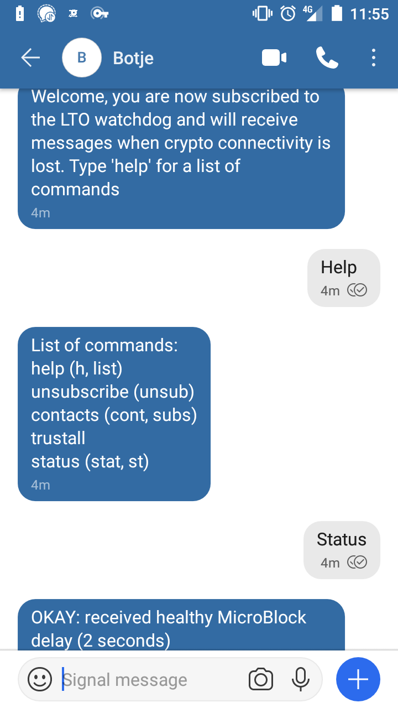
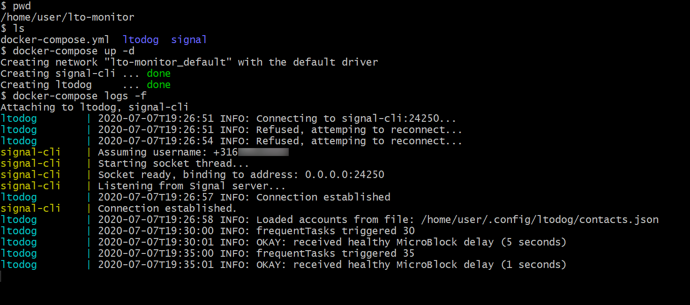

# LTO Watchdog

### NOTICE: this project is replaced by [SignalBot LTO](https://github.com/Matteljay/signalbot-lto)

## Cryptocurrency server monitoring tool

- License: MIT License
- Author: Matteljay
- Language: Python
- IDE: Visual Studio Code
- Homepage: https://libersystems.com

## Table of contents

- [About](#about)
- [Screenshots](#screenshots)
- [Installation](#installation)
  - [Docker Compose](#docker-compose)
- [Coding details](#Coding-details)
- [Contact info & donations](#contact-info--donations)

## About

LTO Watchdog is an automated [Signal](https://www.signal.org/) chat bot created to offer a third party [watchdog service](https://en.wikipedia.org/wiki/Watchdog_timer) for the [LTO cryptocurrency](https://ltonetwork.com/). It will periodically check if it can connect to your LTO server using [SSH](https://en.wikipedia.org/wiki/Secure_Shell) and calculate the last time a microblock was generated based on the LTO log file. It is easily configured with shell environment variables, this is used in [docker-compose](https://docs.docker.com/compose/) and will be explained below. That way you can quickly deploy this watchdog using container security separation with minimal user privileges. The source code of this chat bot is written in Python with easy to understand classes and variable names so that you can use this project as a basis for your own Signal chat bot.

## Screenshots

## Installation

A forked version of [AsamK's signal-cli](https://github.com/AsamK/signal-cli) is required. The java binaries with the correct version can be downloaded directly from my GitHub repository [here](https://github.com/Matteljay/signal-cli/releases/download/v0.6.8-socket/signal-cli-0.6.8-socket-binaries.tar.gz).

You'll now need to register and verify a phone SIM card with Signal via signal-cli, this is explained [here](https://github.com/Matteljay/signal-cli#usage). Configuration files with chat encryption keys will then be generated in your `~/.config/signal/` folder.

Run signal-cli in socket daemon mode on a separate terminal for now:

    /path/to/bin/signal-cli --singleuser socket -a localhost

This will cause signal-cli to start listening on port `24250` for API commands via JSON strings. In the next section Docker will be used for this step. A [systemd](https://www.shellhacks.com/systemd-service-file-example/) session or [screen](https://www.thegeekdiary.com/how-to-use-the-screen-command-in-linux/) session could also be used to run `signal-cli` as a socket daemon process.

Now the watchdog must be configured for your LTO crypto server. The following commands will generate a new SSH key for the automated login to your server:

    mkdir -pv ~/.config/ltodog
    ssh-keygen -t rsa -f ~/.config/ltodog/id_ssh -N ''
    ssh-copy-id -i ~/.config/ltodog/id_ssh.pub -p 22 user@yourserver.com

Set the correct values for the environment variables in the `run-noDocker` script, the `LTO_LOG_PATH` should also be set here. Then you're ready to run:

    ./run-noDocker

### Docker Compose

The installation with Docker is more robust but you still need the secure identities (configuration files) from the previous section. Have a look at the `lto-monitor/` folder. Here you will find the [docker-compose.yml](lto-monitor/docker-compose.yml) and you will need to copy your configurations there like so:

    cd lto-monitor/
    cp -rv ~/.config/ltodog .
    cp -rv ~/.config/signal .

The variables you changed in `run-noDocker` from the previous section should be set in `docker-compose.yml`. Then just like the screenshot above, launch the Docker containers:

    docker-compose up -d

And see what is happening:

    docker-compose logs -f

Send any message you'd like via Signal to the new SIM number. LTO Watchdog will send you a welcome message and explain which commands it understands.

## Coding details

To get you started customizing this Signal chat bot, the app flow is broken down here succinctly:

**src/ltodog.py**
- is the entry point
- registers Linux signals (keyboard interrupts like Ctrl+C)
- calls UtilStore to verify environment variables
- calls SignalHook which continuously tries to connect to the signal-cli host:port on startup
- loads the custom user subscriptions/privileges
- has the main program loop
- calls Commander to read all the messages from signal-cli that are waiting on the socket buffer
- calls Watcher to see if any jobs need to be run (think Linux [CRON-tab](https://en.wikipedia.org/wiki/Cron))
- if the socket connection is lost an attempt is made to reconnect

## Contact info & donations

More info here: [Contact](CONTACT.md)
